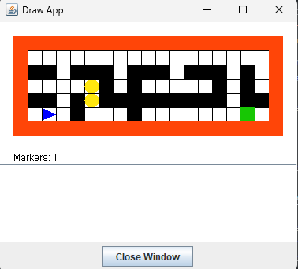

# MazeBot

A maze generation and searching program in C

### Description

A robot (light blue) navigates a maze trying to find all the markers (yellow) placed in the maze and return them to the home square (green).

- random maps - the number of rows, columns, the cell size and screen size are assigned randomly on each run
- the maze is generated based on the Sidewinder algorithm (randomly carve up or right when available)
- robot pathfinding is done with an EAST-NORTH-WEST-SOUTH priority

### How to run

To compile the program use `gcc -o MazeBot main.c graphics.c grid.c robot.c`

To run the program use `.\MazeBot.out | java -jar drawapp-4.0.jar` (Linux) or `.\MazeBot.exe | java -jar drawapp-4.0.jar` (Windows)

The program will run on its own, and `Drawing completed` will be printed in the drawapp display box.